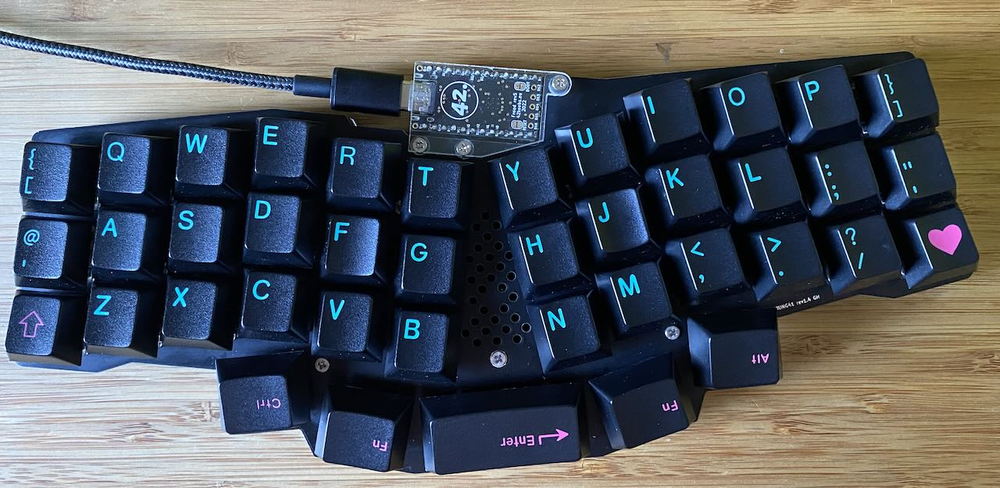

# QMK Keymap for my reviung41



* Checkout in the Reviung41 keymap directory.
* Compile / flash with:

```
qmk compile -kb reviung/reviung41 -km reviung41-keymap -e CONVERT_TO=promicro_rp2040
qmk flash -kb reviung/reviung41 -km reviung41-keymap -e CONVERT_TO=promicro_rp2040
```

*I use a Raspberry Pi RP2040 pro micro controller hence the CONVERT_TO.*
